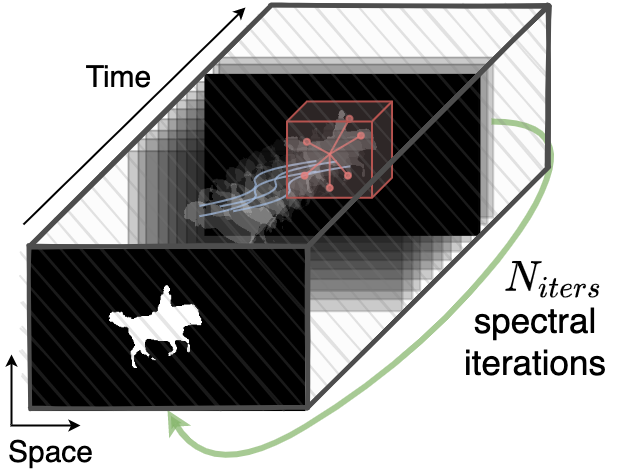
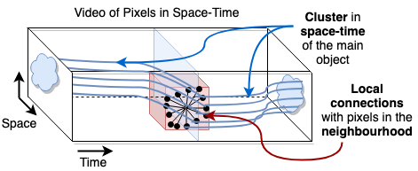

# SFSeg

* **Title**: A 3D Convolutional Approach to Spectral Object Segmentation in Space and Time
* **Authors**: Elena Burceanu, Marius Leordeanu
* **Paper** (published at IJCAI-2020): https://www.ijcai.org/Proceedings/2020/69

We formulate object segmentation in video as a graph partitioning problem in space and time, in which nodes are pixels and their relations form local neighborhoods. We claim that the strongest cluster in this pixel-level graph represents the salient object segmentation. We compute the main cluster using a novel and fast 3D filtering technique that finds the spectral clustering solution, namely the principal eigenvector of the graph's adjacency matrix, without building the matrix explicitly - which would be intractable. Our method is based on the power iteration for finding the principal eigenvector of a matrix, which we prove is equivalent to performing a specific set of 3D convolutions in the space-time feature volume. This allows us to avoid creating the matrix and have a fast parallel implementation on GPU. We show that our method is much faster than classical power iteration applied directly on the adjacency matrix. Different from other works, ours is dedicated to preserving object consistency in space and time at the level of pixels. For that, it requires powerful pixel-wise features at the frame level. This makes it perfectly suitable for incorporating the output of a backbone network or other methods and fast-improving over their solution without supervision. In experiments, we obtain consistent improvement, with the same set of hyper-parameters, over the top state of the art methods on DAVIS-2016 dataset, both in unsupervised and semi-supervised tasks. We also achieve top results on the well-known SegTrackv2 dataset.

<p float="left">
   
  
</p>


### Key aspects:
1. **Formulating segmentation in video** as a problem of finding the **main space-time cluster**, represented by the leading eigenvector of the pixel-level adjacency matrix of the **video's graph in space-time**.
2. **Fast algorithm: SFSeg** is a **3D spectral filtering algorithm**, that computes the main eigenvector **without explicitly computing the graph’s adjacency matrix**. This transforms the problem into a **tractable** one. 
3. **Refinement: SFSeg** can be used as a powerful refinement method. It is **faster and more accurate** then the well known space-time approach using CRF (denseCRF).


### Run:
- input: input_masks.th (unary term) and features.th (pairwise term)
- output: output segmentation
- sample folder: input_masks.th and features.th maps are a segmentation map (the same)
`python main.py`


### Please refer to it as:
```
@inproceedings{burceanu-sfseg,
  title     = {A 3D Convolutional Approach to Spectral Object Segmentation in Space and Time},
  author    = {Burceanu, Elena and Leordeanu, Marius},
  booktitle = {Proceedings of the Twenty-Ninth International Joint Conference on
               Artificial Intelligence, {IJCAI-20}},
  url       = {https://doi.org/10.24963/ijcai.2020/69},
}
```
